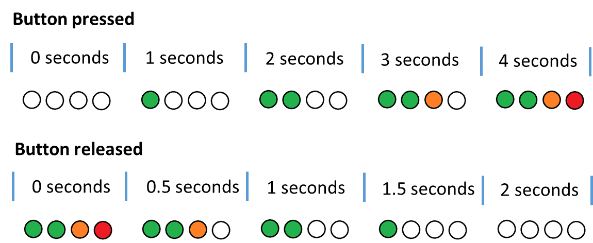

# First Challenge (Control LEDs Based on Button Press Time)

This challenge will help you:
- Learn how to create a project using STM32CubeIDE;
- Learn how to interpret a hardware datasheet;
- Get used to using APIs/drivers in a project.

## Challenge

In this challenge, you will write code to control LEDs based on how long the user button is pressed. For each second the button is held down, one LED should turn on. When the button is released, one LED should turn off every half second.

  

The image above shows what should happen when the button is pressed or released.

## Steps

### 1. Create a Project
- Open STM32CubeIDE and create a project for the STM32F401RBT6 microcontroller.

### 2. Add Peripherals and Set Pinout
- Open the folder "[Hardware](../../Hardware/)" in this repository. Inside, you will find a PDF file containing the hardware datasheet. Look for the sheet with the microcontroller pinout to check which pins are in use.
- For this challenge, identify the pins for the LEDs (LED1, LED2, LED3, LED4) and the button (Button1).
- No additional peripherals are needed for this challenge.

### 3. Add the "Project" Folder to Your STM32 Project
- Copy the "Project" folder and add it to your STM32 project.

### 4. Call the Manager Functions
- To keep the `main.c` file clean, the core logic will be written in `manager.c`.
- Include `manager.h` in `main.c`, and call the functions `Manager_Initialize()` and `Manager_Loop()`.

### 5. Write the Manager Code
- Use the `manager.c` file to implement the code for this challenge.

### 6. Use the UI API Provided in the Project/UI Folder
- Adapt your code in `manager.c` to use the UI API. **Do not modify the UI API.**

### 7. (Optional) Enable `printf` for Debugging
- Enable `printf` functionality to assist with debugging.
