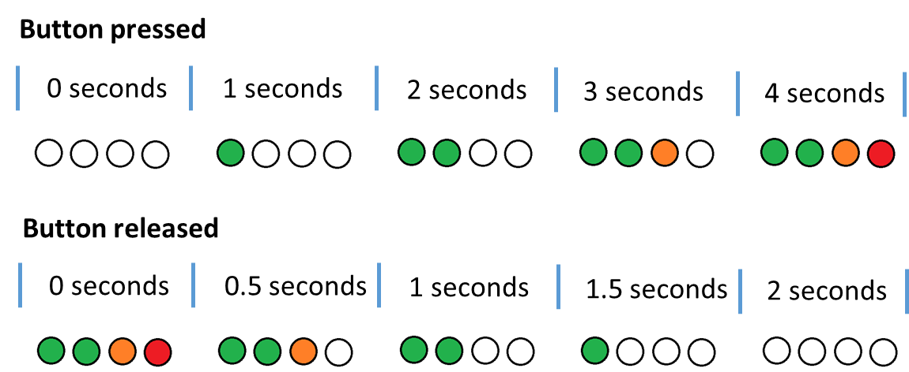

# Firmware
> Versions:
>
> FW: 01.00 \
> HW: 01.00

This firmware is capable of swapping between two operation modes:
- LEDs follow the button;
- LEDs follow the temperature.

### LEDs follow the button
In this mode, the LEDs should start turning on while the button is being pressed. When the button is released, the LEDs should start turning off. When they are turning on, it should start with the first green, then the second green, then the orange, and lastly the red.

Each LED should turn on every second and turn off every half a second.

  

> [!Note]
> When an LED is turned on/off, it should be indicated in the UART.

### LEDs follow the temperature
In this mode, the LEDs should represent the ambient temperature based on an initial temperature.
- When the temperature is between -1ºC and +0.5ºC in comparison to the based temperature, the first LED should be on;
- When the temperature is below the based temperature by 1ºC, all the LEDs should be off;
- When the temperature is above the based temperature by 0.5ºC, 1ºC, and 1.5ºC the second green, orange, and red LEDs should be on, respectively.

It is also possible to set a new base temperature by pressing the button. This will change the default temperature (24ºC) for a new base temperature.

  

> [!Note]
> The temperature and humidity values are updated and printed in the UART every half a second.

## How to use
To swap between modes, use the switch.

When in the ***LEDs follow the button*** mode just press the button continuously to turn on each LED at a time. Release the button for them to start turn off.

When in the ***LEDs follow the temperature*** mode just press the button to set the base temperature (if wanted) and let the system react with the temperature variations.
