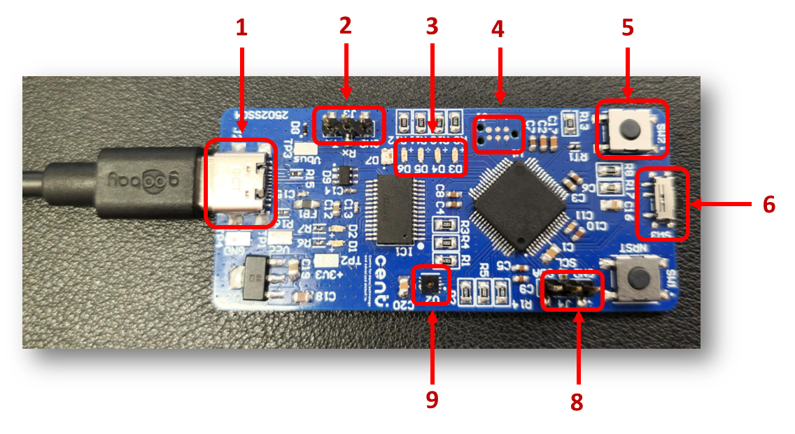

# Hardware
> Version: 01.00

## Hardware resources
The following image describes the resources important for the firmware.

Number | Name | Description
|:---:|:---:|:---:|
1   | USB type-C connector  | Power the hardware and UART debug output
2   | UART header           | Pins to debug UART communication
3   | LEDs                  | 2 green, 1 orange, 1 red LEDs
4   | Programming pads      | Pads to program the microcontroller
5   | User button           | Button to interact with the system
6   | User switch           | Switch to interact with the system
7   | Reset button          | Hard reset button
8   | I2C header            | Pins to debug I2C communication
9   | SHT31 sensor          | Temperature and humidity sensor
